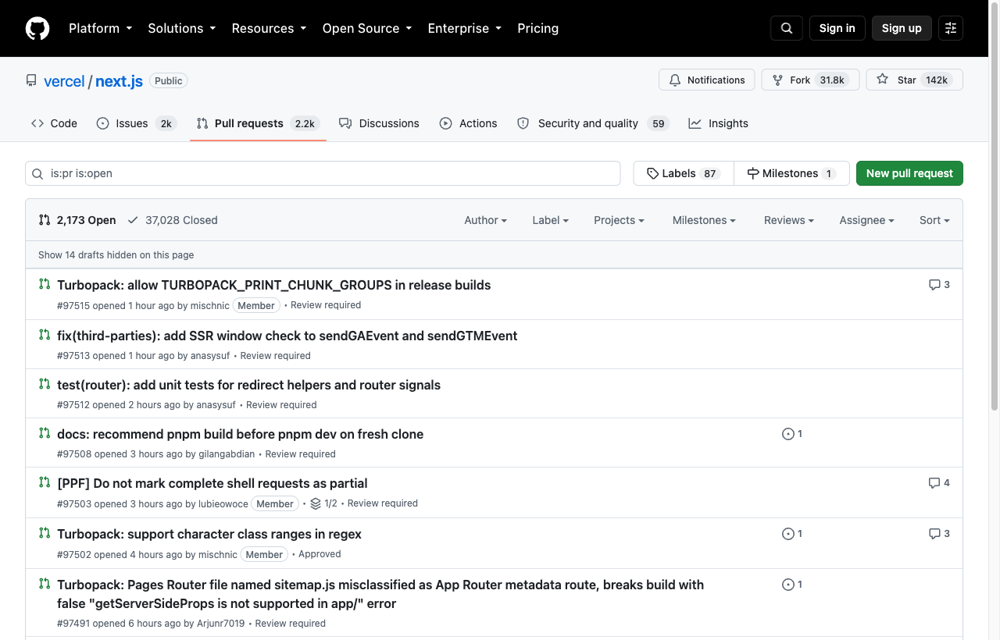
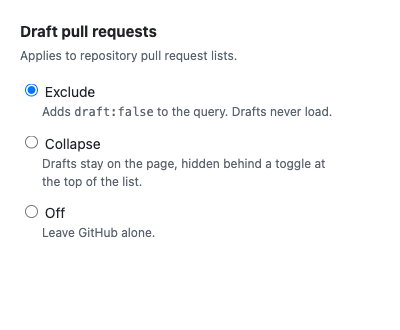

# GitHub draft PRs

Keeps draft pull requests out of your way on repository PR lists. Ships as a Chrome extension and
as a userscript built from the same source.



## Modes

Pick one at `chrome://extensions` → Details → Extension options.



| Mode | Behavior |
| --- | --- |
| **Exclude** (default) | Adds `draft:false` to the query. Drafts never load. |
| **Collapse** | Drafts stay on the page, hidden behind a "Show N drafts" toggle at the top of the list. |
| **Off** | Leaves GitHub alone. |

Exclude is a query rewrite — server-side, robust, and it applies across pagination. Collapse is DOM
manipulation, so it depends on GitHub's markup and only sees the current page: drafts still consume
slots in the 25-per-page budget, and the count in the toggle is per-page, not per-repo.

## Install as an extension

1. Open `chrome://extensions` and turn on Developer mode.
2. Load unpacked, and pick this directory.

## Install as a userscript

1. Install [Violentmonkey](https://violentmonkey.github.io/) or Tampermonkey.
2. Open [github-exclude-draft-prs.user.js](https://raw.githubusercontent.com/lucasoliveiracruz/gh-exclude-draft-prs/main/github-exclude-draft-prs.user.js) and confirm the install.

The userscript has no options UI — `chrome.storage` is extension-only — so it always runs in the
default mode. To change it, edit `DEFAULT_MODE` in `src/settings.js` and rebuild.

## Behavior

- Applies to repository PR lists only. `draft:false` is invalid on issue lists, and the React
  dashboard at `/pulls` does not read the `q` param the same way — use a saved view there.
- A query already mentioning `draft:`/`is:draft` is left alone, so filtering *to* drafts still works.
- An empty `q` stays unfiltered apart from `draft:false`; only a missing `q` gets the
  `is:pr is:open` default GitHub would have applied.
- Switching to the Closed tab drops the qualifier and `turbo:load` re-adds it.
- Collapse remembers expanded/collapsed in `sessionStorage`, so paging through the list keeps it.
- Switching modes takes effect on the next page load; no reinstall needed.

## Development

`src/` is the source of truth for both targets. `manifest.json` lists the content scripts in load
order, and the userscript is generated by concatenating that same list.

```sh
npm test      # node --test
npm run build # regenerate github-exclude-draft-prs.user.js from src + manifest
```

| File | Role |
| --- | --- |
| `src/settings.js` | Mode storage, with a default when `chrome.storage` is absent |
| `src/exclude-drafts.js` | `nextUrl()` — the pure query rewrite |
| `src/collapse-drafts.js` | Draft-row detection, the toggle, the `MutationObserver` |
| `src/main.js` | Dispatches on the selected mode |

Bump the version in `manifest.json` and rebuild; the userscript header derives from it.
